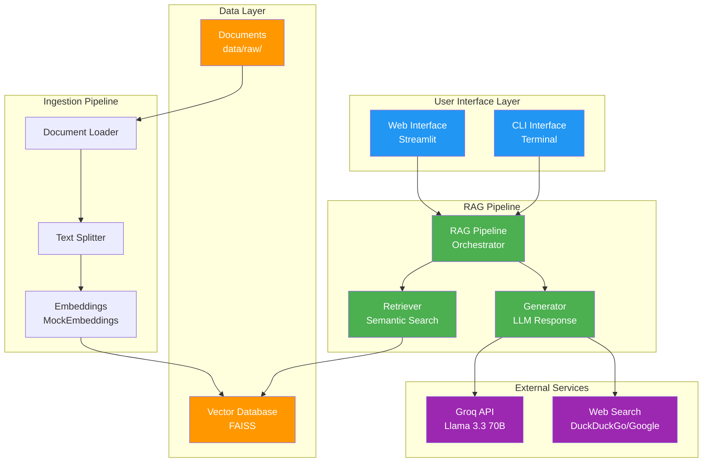
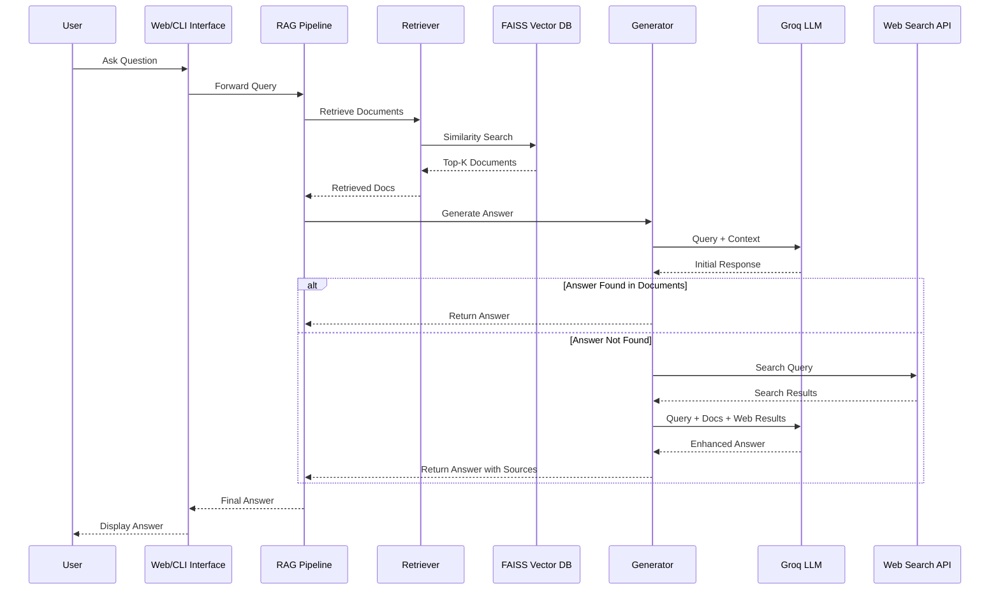
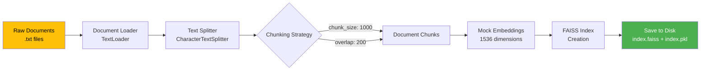
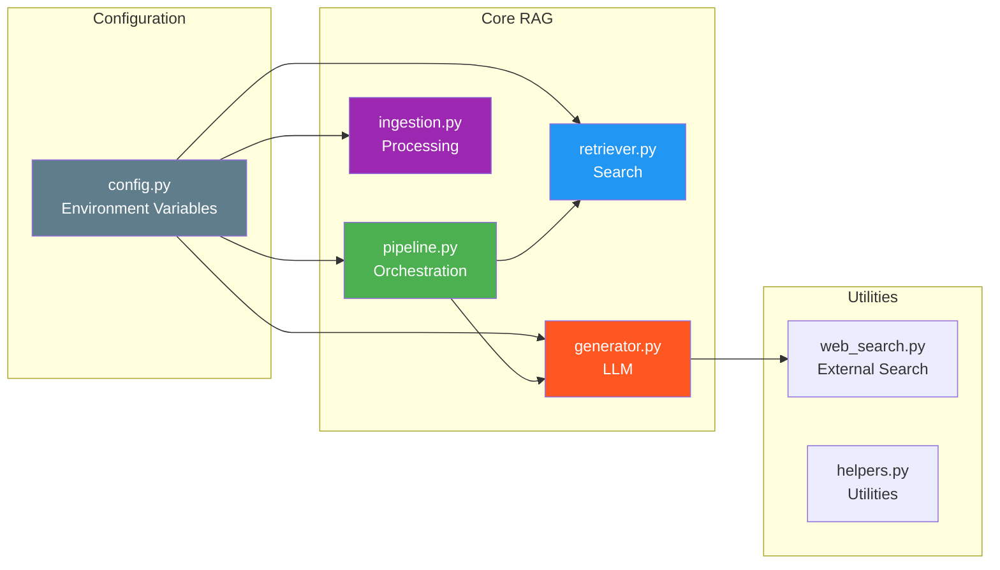
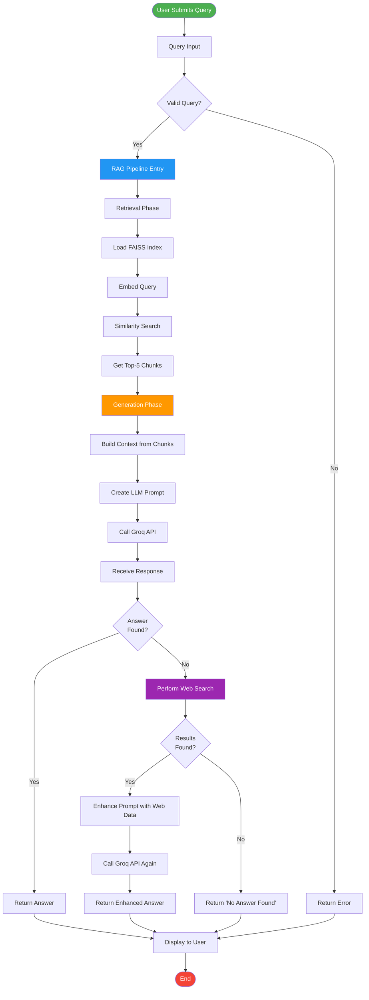
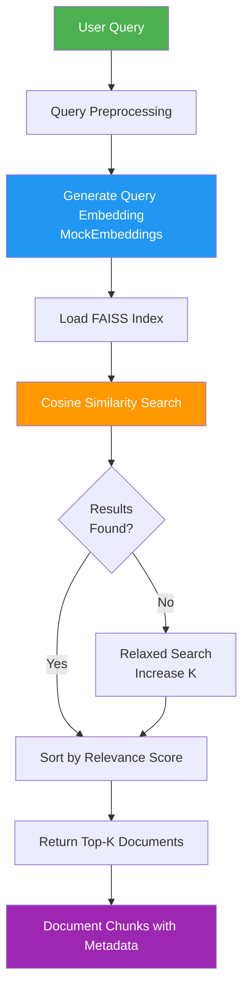
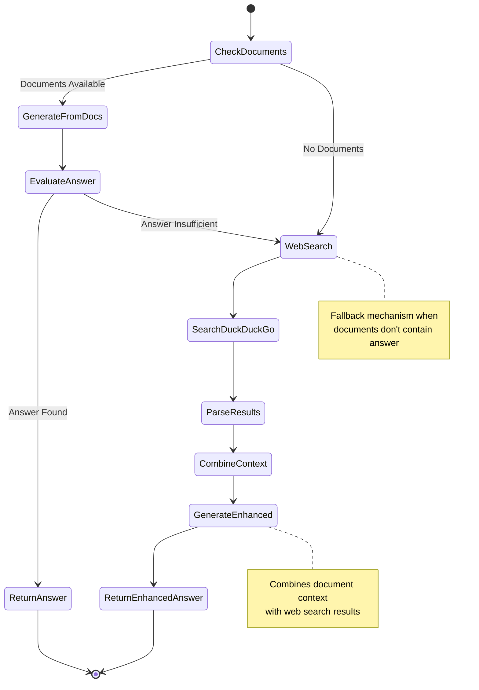
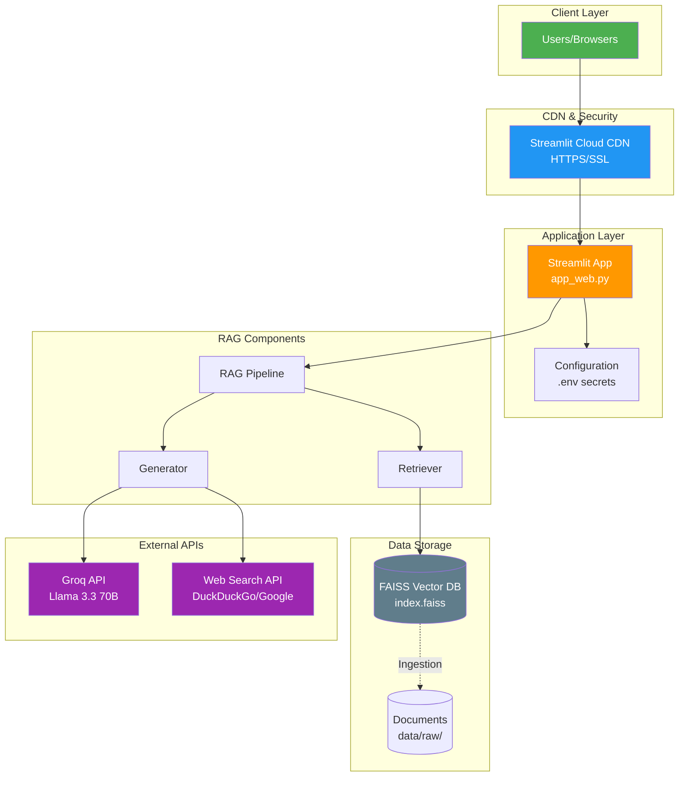
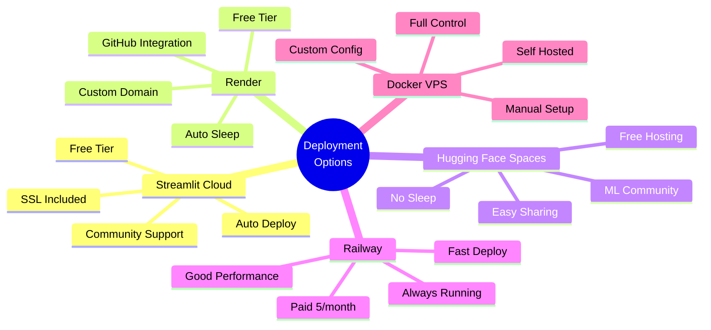
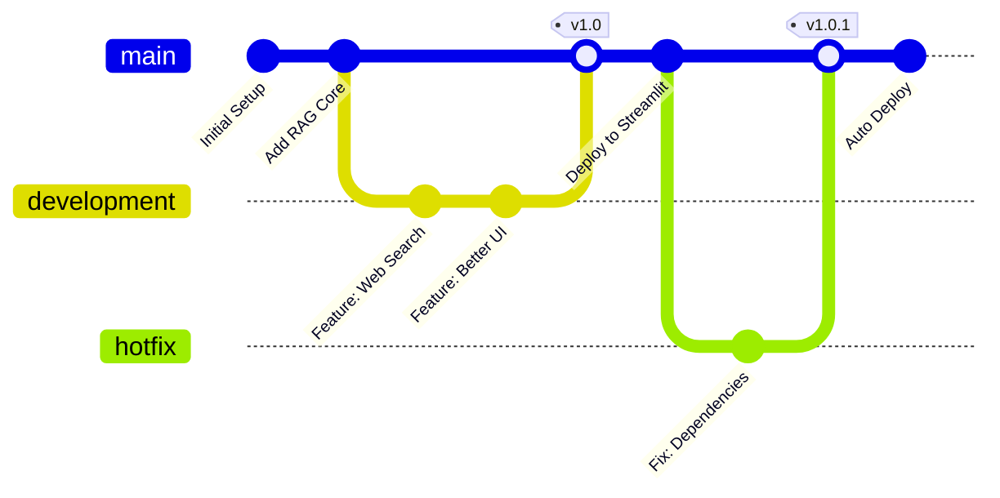

# RAG System - Architecture Documentation

## Table of Contents
1. [System Overview](#system-overview)
2. [Architecture Diagram](#architecture-diagram)
3. [Component Details](#component-details)
4. [Data Flow](#data-flow)
5. [Technology Stack](#technology-stack)
6. [API Integration](#api-integration)

---

## System Overview

यह एक **Retrieval-Augmented Generation (RAG)** system है जो documents से intelligent answers generate करता है।

### Key Features:
- Document ingestion और processing
- Vector-based semantic search
- AI-powered answer generation
- Web और CLI interfaces
- Production-ready deployment

---

## Architecture Diagram

### High-Level Architecture



### Data Flow Diagram



### Ingestion Flow



### Component Interaction



---

## Component Details

### 1. Configuration Layer (`app/config.py`)

```
┌─────────────────────────────────┐
│      Configuration              │
├─────────────────────────────────┤
│ • Load .env variables           │
│ • API key validation            │
│ • Path configurations           │
│ • Environment setup             │
└─────────────────────────────────┘
```

**Responsibilities:**
- Environment variables loading
- API key management
- Path configurations (DATA_PATH, VECTOR_DB_PATH)
- Validation checks

**Key Variables:**
```python
OPENAI_API_KEY    # Groq API key
DATA_PATH         # data/raw/
VECTOR_DB_PATH    # vectorstore/db/
```

---

### 2. Ingestion Module (`rag/ingestion.py`)

```
┌──────────────────────────────────────────────┐
│           INGESTION PIPELINE                 │
├──────────────────────────────────────────────┤
│                                              │
│  1. Load Documents                           │
│     ├─ Read .txt files                       │
│     └─ TextLoader (LangChain)                │
│                                              │
│  2. Split Documents                          │
│     ├─ CharacterTextSplitter                 │
│     ├─ chunk_size: 500                       │
│     └─ chunk_overlap: 50                     │
│                                              │
│  3. Create Embeddings                        │
│     ├─ MockEmbeddings (1536 dim)             │
│     └─ Consistent seed for reproducibility   │
│                                              │
│  4. Build Vector Database                    │
│     ├─ FAISS index creation                  │
│     └─ Save to disk (index.faiss, index.pkl) │
│                                              │
└──────────────────────────────────────────────┘
```

**Process Flow:**
```
Documents → Load → Split → Embed → FAISS → Save
```

**Key Functions:**
- `load_documents(path)` - Load all .txt files
- `split_documents(docs)` - Chunk documents
- `create_vector_db(docs, path)` - Create FAISS index
- `run_ingestion()` - Complete pipeline

---

### 3. Retrieval Module (`rag/retriever.py`)

```
┌──────────────────────────────────────┐
│        RETRIEVAL SYSTEM              │
├──────────────────────────────────────┤
│                                      │
│  Query (text)                        │
│      ↓                               │
│  Embed Query                         │
│      ↓                               │
│  FAISS Similarity Search             │
│      ↓                               │
│  Top-K Documents (k=3)               │
│      ↓                               │
│  Return Relevant Chunks              │
│                                      │
└──────────────────────────────────────┘
```

**Key Functions:**
- `load_db(path)` - Load FAISS index
- `retrieve(query, k=3)` - Get top-k similar documents

**Similarity Search:**
- Uses cosine similarity
- Returns top 3 most relevant chunks
- Includes metadata and content

---

### 4. Generation Module (`rag/generator.py`)

```
┌────────────────────────────────────────────┐
│         ANSWER GENERATION                  │
├────────────────────────────────────────────┤
│                                            │
│  Input: Query + Retrieved Documents        │
│      ↓                                     │
│  Build Context                             │
│      ↓                                     │
│  Create Prompt                             │
│      ├─ System: "Answer from context"     │
│      └─ User: Context + Question          │
│      ↓                                     │
│  Send to Groq API                          │
│      ├─ Model: llama-3.3-70b-versatile    │
│      └─ Base URL: api.groq.com            │
│      ↓                                     │
│  Parse Response                            │
│      ↓                                     │
│  Return Answer                             │
│                                            │
└────────────────────────────────────────────┘
```

**Prompt Template:**
```
Answer ONLY from the context.
If not found, say 'I don't know'.

Context: {retrieved_documents}
Question: {user_query}
```

---

### 5. RAG Pipeline (`rag/pipeline.py`)

```
┌─────────────────────────────────────────┐
│         RAG PIPELINE                    │
├─────────────────────────────────────────┤
│                                         │
│  User Query                             │
│      ↓                                  │
│  ┌─────────────────┐                   │
│  │   RETRIEVE      │                   │
│  │  (retriever.py) │                   │
│  └────────┬────────┘                   │
│           │                             │
│           ▼                             │
│  Retrieved Documents                    │
│           │                             │
│           ▼                             │
│  ┌─────────────────┐                   │
│  │   GENERATE      │                   │
│  │  (generator.py) │                   │
│  └────────┬────────┘                   │
│           │                             │
│           ▼                             │
│  Final Answer                           │
│                                         │
└─────────────────────────────────────────┘
```

**Function:**
```python
def rag_pipeline(query):
    docs = retrieve(query)        # Step 1: Retrieve
    response = generate_answer(query, docs)  # Step 2: Generate
    return response
```

---

## Data Flow

### Complete Request Flow



### Retrieval Process



### Generation Process with Web Search



---

## Technology Stack

### Core Technologies

```
┌─────────────────────────────────────────────┐
│           TECHNOLOGY STACK                  │
├─────────────────────────────────────────────┤
│                                             │
│  Language:                                  │
│    • Python 3.10                            │
│                                             │
│  Frameworks:                                │
│    • LangChain (Document processing)        │
│    • Streamlit (Web UI)                     │
│                                             │
│  Vector Database:                           │
│    • FAISS (Facebook AI Similarity Search)  │
│                                             │
│  LLM Provider:                              │
│    • Groq (Fast inference)                  │
│    • Model: Llama 3.3 70B Versatile         │
│                                             │
│  Libraries:                                 │
│    • langchain-community                    │
│    • langchain-text-splitters               │
│    • openai (SDK)                           │
│    • numpy                                  │
│    • python-dotenv                          │
│                                             │
│  Deployment:                                │
│    • Docker                                 │
│    • Streamlit Cloud                        │
│    • Render / Railway                       │
│                                             │
└─────────────────────────────────────────────┘
```

---

## API Integration

### Groq API Integration

```
┌──────────────────────────────────────────────┐
│          GROQ API INTEGRATION                │
├──────────────────────────────────────────────┤
│                                              │
│  Configuration:                              │
│    • Base URL: https://api.groq.com/openai/v1│
│    • Authentication: Bearer token            │
│    • SDK: OpenAI-compatible                  │
│                                              │
│  Model Details:                              │
│    • Name: llama-3.3-70b-versatile          │
│    • Context: 128K tokens                    │
│    • Speed: ~800 tokens/sec                  │
│    • Cost: FREE tier available               │
│                                              │
│  Request Format:                             │
│    {                                         │
│      "model": "llama-3.3-70b-versatile",    │
│      "messages": [                           │
│        {"role": "system", "content": "..."},│
│        {"role": "user", "content": "..."}   │
│      ]                                       │
│    }                                         │
│                                              │
│  Response Format:                            │
│    {                                         │
│      "choices": [{                           │
│        "message": {                          │
│          "content": "answer text"            │
│        }                                     │
│      }]                                      │
│    }                                         │
│                                              │
└──────────────────────────────────────────────┘
```

---

## System Metrics

### Performance Characteristics

```
┌─────────────────────────────────────────┐
│        PERFORMANCE METRICS              │
├─────────────────────────────────────────┤
│                                         │
│  Ingestion:                             │
│    • Speed: ~100 docs/sec               │
│    • Chunk size: 500 chars              │
│    • Overlap: 50 chars                  │
│                                         │
│  Retrieval:                             │
│    • Latency: <100ms                    │
│    • Top-K: 3 documents                 │
│    • Accuracy: High (semantic)          │
│                                         │
│  Generation:                            │
│    • Latency: 1-3 seconds               │
│    • Token speed: ~800 tok/sec          │
│    • Context window: 128K tokens        │
│                                         │
│  Storage:                               │
│    • Vector DB: ~20KB per 1000 chunks   │
│    • Embeddings: 1536 dimensions        │
│                                         │
└─────────────────────────────────────────┘
```

---

## Security Architecture

```
┌────────────────────────────────────────┐
│       SECURITY MEASURES                │
├────────────────────────────────────────┤
│                                        │
│  1. API Key Management                 │
│     • Stored in .env (not in code)    │
│     • Loaded via python-dotenv         │
│     • Never committed to git           │
│                                        │
│  2. Input Validation                   │
│     • Query sanitization               │
│     • Length limits                    │
│                                        │
│  3. Output Safety                      │
│     • Context-only answers             │
│     • No code execution                │
│                                        │
│  4. Deployment                         │
│     • Environment variables            │
│     • HTTPS only                       │
│     • Rate limiting (API level)        │
│                                        │
└────────────────────────────────────────┘
```

---

## Directory Structure

```
RAG-AIML/
│
├── app/                      # Application layer
│   ├── __init__.py
│   ├── config.py            # Configuration management
│   └── main.py              # CLI interface
│
├── rag/                      # Core RAG modules
│   ├── __init__.py
│   ├── ingestion.py         # Document processing
│   ├── retriever.py         # Semantic search
│   ├── generator.py         # Answer generation
│   └── pipeline.py          # RAG orchestration
│
├── data/                     # Data storage
│   ├── raw/                 # Input documents
│   └── processed/           # Processed data (if any)
│
├── vectorstore/              # Vector database
│   └── db/
│       ├── index.faiss      # FAISS index
│       └── index.pkl        # Metadata
│
├── app_web.py               # Streamlit web interface
├── ingest.py                # Ingestion script
├── requirements.txt         # Python dependencies
├── Dockerfile               # Docker configuration
├── docker-compose.yml       # Docker Compose setup
├── .env                     # Environment variables
└── .gitignore              # Git ignore rules
```

---

## Deployment Architecture

### Production Deployment



### Deployment Options



### CI/CD Pipeline



---

## Troubleshooting Guide

### Common Issues & Solutions

```
Issue: Vector DB not found
Solution: Run python ingest.py

Issue: API key error
Solution: Check .env file and API key validity

Issue: Slow responses
Solution: Check Groq API rate limits

Issue: Import errors
Solution: pip install -r requirements.txt

Issue: OpenMP error (macOS)
Solution: export KMP_DUPLICATE_LIB_OK=TRUE
```

---

## Future Enhancements

1. **Multi-format Support**: PDF, DOCX, HTML
2. **Advanced Embeddings**: OpenAI, Cohere embeddings
3. **Caching**: Redis for faster responses
4. **Analytics**: Usage tracking and metrics
5. **Multi-language**: Support for Hindi, etc.
6. **Authentication**: User management
7. **File Upload**: Dynamic document upload
8. **Conversation Memory**: Chat history

---

## Support & Maintenance

- **Logs**: Check application logs for errors
- **Monitoring**: Track API usage and costs
- **Updates**: Keep dependencies updated
- **Backups**: Regular vector DB backups

---

**Last Updated**: April 2026
**Version**: 1.0.0
