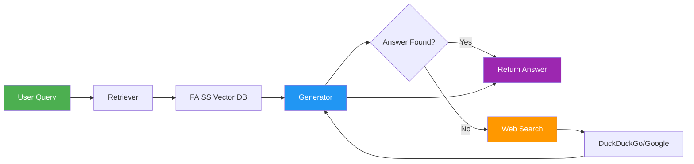

# RAG System with Groq API

A production-ready Retrieval-Augmented Generation (RAG) system using LangChain, FAISS, and Groq's free API.

[](https://www.python.org/downloads/)
[](https://opensource.org/licenses/MIT)
[](https://streamlit.io)

## Features

- Document ingestion and intelligent chunking
- Vector-based semantic search with FAISS
- AI-powered answers using Groq's Llama 3.3 70B
- **Web search integration** - Falls back to DuckDuckGo/Google when answer not in documents
- Interactive web interface (Streamlit)
- Production-ready with Docker support
- Completely free to use
- Mermaid architecture diagrams for clear visualization

## Quick Start

### 1. Clone & Install
```bash
git clone https://github.com/adarsh-priydarshi-5646/RAG-Model-AIML.git
cd RAG-Model-AIML
pip install -r requirements.txt
```

### 2. Configure API Key
Create `.env` file:
```bash
OPENAI_API_KEY=gsk_your_groq_api_key_here
```
Get free API key: https://console.groq.com/keys

### 3. Ingest Documents
```bash
python ingest.py
```

### 4. Run Application

**Web Interface:**
```bash
streamlit run app_web.py
```
Open: http://localhost:8501

**CLI Interface:**
```bash
./run.sh
```

## Documentation

- **[Architecture Guide](ARCHITECTURE.md)** - Complete system architecture, diagrams, and technical details

## Architecture Overview



For detailed architecture diagrams and flow, see [ARCHITECTURE.md](ARCHITECTURE.md)

## Deployment

### Streamlit Cloud (Recommended - FREE)
1. Push to GitHub ✅
2. Go to https://share.streamlit.io/
3. Connect repository
4. Add secret: `OPENAI_API_KEY`
5. Deploy!

### Docker
```bash
docker-compose up -d
```

### Other Options
- Render (Free tier)
- Hugging Face Spaces
- Railway ($5/month)

## Project Structure

```
RAG-AIML/
├── app/              # Application configuration
├── rag/              # Core RAG modules
│   ├── ingestion.py  # Document processing
│   ├── retriever.py  # Semantic search
│   ├── generator.py  # Answer generation
│   └── pipeline.py   # RAG orchestration
├── data/raw/         # Input documents
├── vectorstore/db/   # FAISS database
├── app_web.py        # Web interface
└── ingest.py         # Ingestion script
```

## Technology Stack

- **Language**: Python 3.11
- **Framework**: Streamlit
- **Vector DB**: FAISS
- **LLM**: Groq (Llama 3.3 70B)
- **Deployment**: Docker, Streamlit Cloud

## API Configuration

- **Provider**: Groq
- **Base URL**: `https://api.groq.com/openai/v1`
- **Model**: `llama-3.3-70b-versatile`
- **Cost**: FREE tier available

## Usage Example

```python
from rag.pipeline import rag_pipeline

answer = rag_pipeline("Who created Python?")
print(answer)  # Output: Guido van Rossum
```

## How It Works

1. **Ingestion**: Documents are loaded, split into chunks, and stored in FAISS vector database
2. **Retrieval**: User query is embedded and similar chunks are retrieved (top-5)
3. **Generation**: Retrieved context + query is sent to Groq LLM
4. **Web Search Fallback**: If answer not found in documents, automatically searches web (DuckDuckGo/Google)
5. **Response**: AI generates answer from documents or web search results with source citations

## Contributing

Contributions welcome! Please open an issue or submit a PR.

## License

MIT License

## Author

Adarsh Priydarshi
- GitHub: [@adarsh-priydarshi-5646](https://github.com/adarsh-priydarshi-5646)

---

**For detailed architecture, diagrams, and technical documentation, see [ARCHITECTURE.md](ARCHITECTURE.md)**
